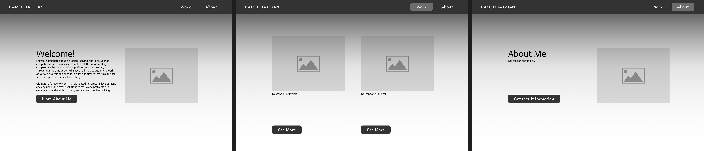
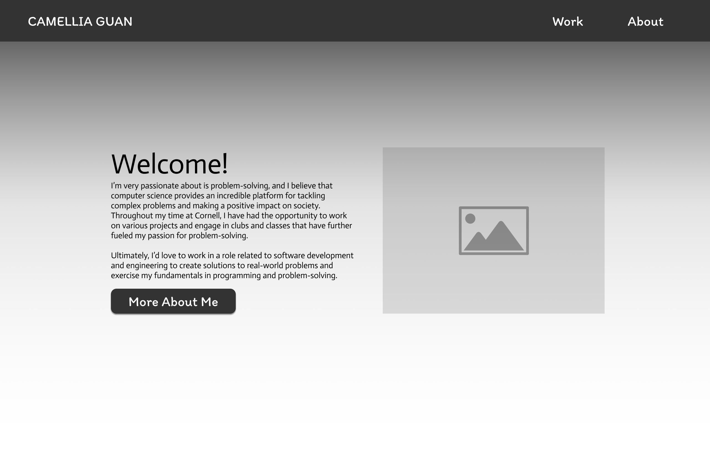
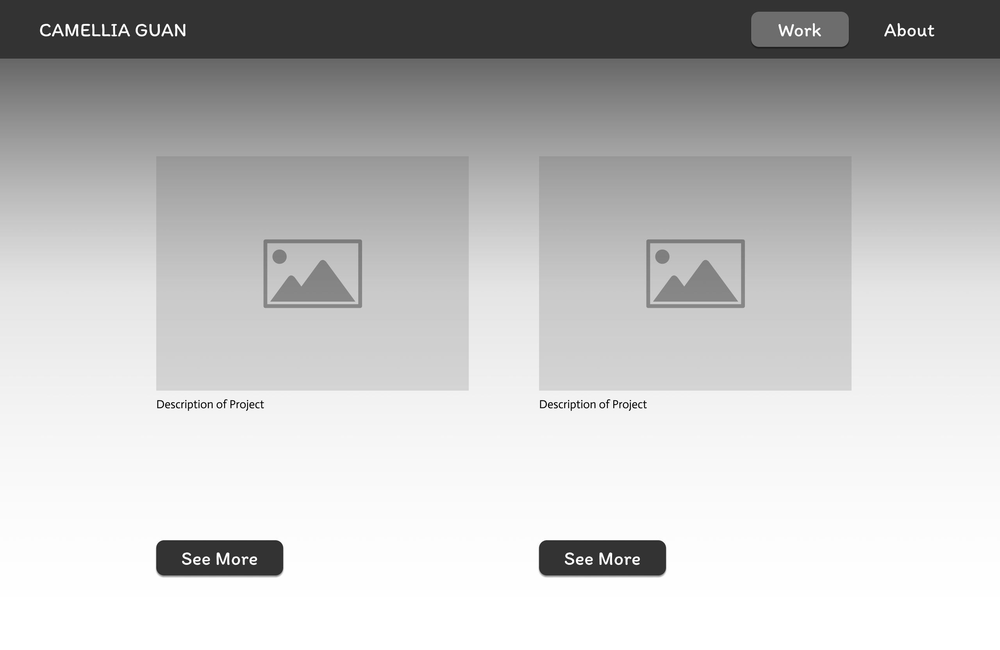
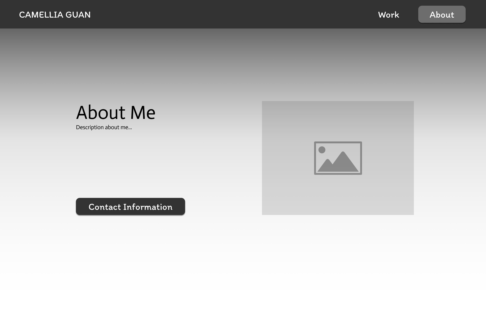

# ENGRC 3025: Professional Website

## Purpose of Project
This repository was made for my ENGRC 3025 Final Project, in which I create a professional website that displays my skills, projects, and overall resume. This website will showcase the web development skills that I have learned, including HTML, CSS, and JavaScript.

## File Overview
The *File Overview* section outlines the main files of the project.

 ← README.md

 ← index.html

 

### /pages

 ← about.html

 ← portfolio.html

 ← resume.html

 

### /scripts

 

### /styles

 ← site.css

## Design Choices: Prototype + Wireframes

The wireframe and prototype of the website includes a home page, about page, and portfolio page. However, I realized that it did not have enough interactivity to my liking, and I also wanted the home page to be more eye-catching than I designed it to be, as audience retainment is a goal of mine. To fix this, 

A project requirement is that the website also have at least 4 pages or section, so another page will be added to satisfy this requirement, which will outline technical and soft skills from my resume, as well as work experience.

 

__Overall Website__

__Home Page__

__Portfolio Page__

__About Page__

## Citations

The *Citations* section cites any outside sources that I may have used throughout the project and also describes the part of the project the source was used for.

| Project Section | Description of Section | Source |
| - | - | - |
| Font | This is the main font used throughout the website (Source Code Pro). | https://fonts.google.com/specimen/Source+Code+Pro?query=code |